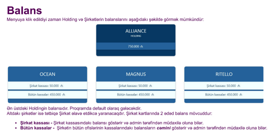
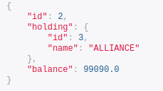
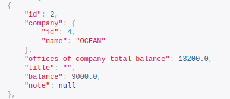
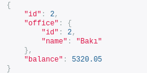

######
Balans
######

+------+
|Balans|
+------+

Balans
------

+-------------+
|Holding Kassa|
+-------------+

Holding Kassa
-------------

- Holding kassa, holdinq əlavə edildiyi zaman avtomatik create edilir.
- endpoint: "http://localhost:8000/api/v1/cashbox/holding-cashbox/"

- Update Holding kassa
    - endpoint: "http://localhost:8000/api/v1/cashbox/holding-cashbox/1/"
    - put sorğusu patch kimi işləyir. Fieldlər tək tək və ya toplu şəkildə update edilə bilinir

.. code:: json

  {
    "balance": 0
  }

- Bütün holding kassa balanslarına baxmaq
    - endpoint: "http://localhost:8000/api/v1/cashbox/holding-cashbox/"

- Filter
    - endpoint: "http://localhost:8000/api/v1/cashbox/holding-cashbox/?holding__id=&holding__name=&holding__name__icontains="

- İD-ə görə holding kassasını tapmaq
    - endpoint: "http://localhost:8000/api/v1/cashbox/holding-cashbox/1/"

+------------+
|Şirkət Kassa|
+------------+

Şirkət Kassa
------------

- Şirkət kassa, şirkət əlavə edildiyi zaman avtomatik create edilir.
- endpoint: "http://localhost:8000/api/v1/cashbox/office-cashbox/"

- Update Company CashBox
    - endpoint: "http://localhost:8000/api/v1/cashbox/office-cashbox/1/"
    - put sorğusu patch kimi işləyir. Fieldlər tək tək və ya toplu şəkildə update edilə bilinir

.. code:: json

  {
    "balance": 0
  }

- Bütün şirkət kassa balanslarına baxmaq
    - endpoint: "http://localhost:8000/api/v1/cashbox/office-cashbox/"

- Filter
    - endpoint: "http://localhost:8000/api/v1/cashbox/office-cashbox/?company__id=&company__name=&company__name__icontains=&company__is_active=unknown&balance=&balance__gte=&balance__lte="

- İD-ə görə şirkət kassasını tapmaq
    - endpoint: "http://localhost:8000/api/v1/cashbox/office-cashbox/1/"

+----------+
|Ofis Kassa|
+----------+

Ofis Kassa
-----------

- Ofis kassa, ofis əlavə edildiyi zaman avtomatik create edilir.
- endpoint: "http://localhost:8000/api/v1/cashbox/office-cashbox/"

- Update Office CashBox
    - endpoint: "http://localhost:8000/api/v1/cashbox/office-cashbox/1/"
    - put sorğusu patch kimi işləyir. Fieldlər tək tək və ya toplu şəkildə update edilə bilinir

.. code:: json

  {
    "balance": 0
  }

- Bütün ofis kassa balanslarına baxmaq
    - endpoint: "http://localhost:8000/api/v1/cashbox/office-cashbox/"

- Filter
    - endpoint: "http://localhost:8000/api/v1/cashbox/office-cashbox/?office__id=&office__name=&office__name__icontains=&office__is_active=unknown&office__company__id=&office__company__name=&office__company__name__icontains=&balance=&balance__gte=&balance__lte="

- İD-ə görə ofis kassasını tapmaq
    - endpoint: "http://localhost:8000/api/v1/cashbox/office-cashbox/1/"
