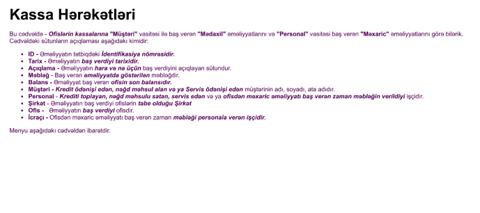
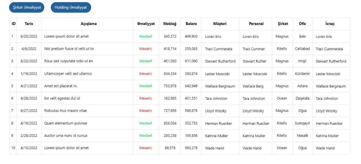
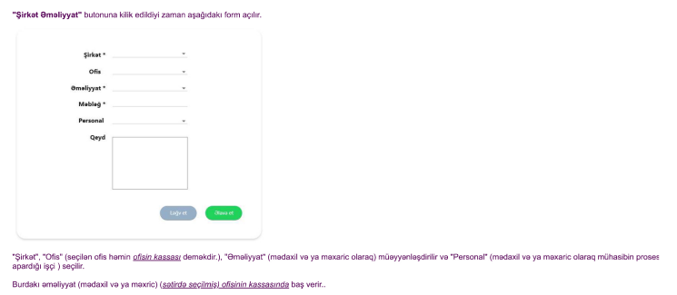

#################
Kassa Hərəkətləri
#################

+-----------------+
|Kassa Hərəkətləri|
+-----------------+

Kassa Hərəkətləri
-----------------

- Jsonda gələn data:
    - date - (Tarix - Date)
    - description - nullable, (Açıqlama - String)
    - operation_style - (Əməliyyat növü - Enum<String>["MƏDAXİL", "MƏXARİC"])
    - quantity - (miqdar - Float)
    - customer - nullable, (Müştəri - Customer)
    - personal - (Personal - User)
    - company - nullable, (Company - Şirkət)
    - office - nullable, (Office - Ofis)
    - initial_balance - (İlkin balans - Float)
    - subsequent_balance - (Sonrakı balans - Float)
    - holding_initial_balance - (Holdinq İlkin balans - Float)
    - holding_subsequent_balance - (Holdinq Sonrakı balans - Float)
    - company_initial_balance - (Şirkət İlkin balans - Float)
    - company_subsequent_balance - (Şirkət Sonrakı balans - Float)
    - office_initial_balance - (Ofis İlkin balans - Float)
    - office_subsequent_balance - (Ofis Sonrakı balans - Float)

.. image:: _static/ss35.png
   :width: 1000px
   :height: 200px
   :alt: melumat
   :align: center

- Bütün Kassa Hərəkətləri
    - endpoint: "http://localhost:8000/api/v1/cashbox/cashflow/"

- Filter
    - endpoint: "http://localhost:8000/api/v1/cashbox/cashflow/?executor=&executor__fullname=&executor__fullname__icontains=&executor__position__name=&executor__position__name__icontains=&executor__employee_status__status_name=&executor__employee_status__status_name__icontains=&holding__name=&holding__name__icontains=&holding=&office__name=&office__name__icontains=&office=&company__name=&company__name__icontains=&company=&initial_balance=&initial_balance__gte=&initial_balance__lte=&subsequent_balance=&subsequent_balance__gte=&subsequent_balance__lte=&description=&description__icontains=&operation_style=&operation_style__icontains=&date=&date__gte=&date__lte="

- İd-ə görə Kassa Hərəkətləri
    - endpoint: "http://localhost:8000/api/v1/cashbox/cashflow/1/"

+----------------+
|Şirkət Əməliyyat|
+----------------+

Şirkət Əməliyyat
----------------

- Şirkət Əməliyyatı etmək
    - endpoint: "http://localhost:8000/api/v1/cashbox/company-cashbox-operation/"
    - Json-da göndərilməli olan datalar:
        - "sending_company_id" -> nullable, Göndərən şirkət - Company id
            - Göndərən fieldinə şirkət id-si qeyd edilərsə həmin şirkətdən holdingə transfer əməliyyatı edilir.
            - Şirkətlərin id-ləri üçün endpoint: "http://localhost:8000/api/v1/company/?is_active=true"
        - "receiving_company_id" -> nullable, Qəbul edən şirkət - Company id
            - Qəbul edən fieldinə şirkət id-si qeyd edilərsə holdingdən həmin şirkətə transfer əməliyyatı edilir.
            - Şirkətlərin id-ləri üçün endpoint: "http://localhost:8000/api/v1/company/?is_active=true"
        - "transfer_amount" -> required,transfer məbləği - float
        - "transfer_note" -> nullable, transfer qeydi - str
    - sending_company_id və receiving_company_id-dən yalnız 1 göndərilməlidir, 2-si bir yerdə göndərilə bilməz.

.. code:: json

  {
    "sending_company_id": 4,
    "receiving_company_id": null,
    "transfer_amount": 100,
    "transfer_note": "test company to holding transfer"
  }

- Bütün Şirkət Əməliyyatlarına bax
    - endpoint: "http://localhost:8000/api/v1/cashbox/company-cashbox-operation/"
    - Json-da gələn data:
        - "executor" -> icra edən işçi - User
        - "sending_company" -> Göndərən şirkət - Company
        - "receiving_company" -> Qəbul edən şirkət - Company
        - "transfer_amount" -> transfer məbləği - float
        - "transfer_date" -> Transfer tarixi - Date
        - "transfer_note" -> Transfer qeydi - String
        - "recipient_subsequent_balance" -> Qəbul edən son balansı - float
        - "sender_subsequent_balance" -> Göndərən son balansı - float

.. image:: _static/ss25.png
   :width: 300px
   :height: 200px
   :align: center

- Filter:
    - "http://localhost:8000/api/v1/cashbox/company-cashbox-operation/?executor__fullname=&executor__fullname__icontains=&executor__position__name=&executor__position__name__icontains=&executor__employee_status__status_name=&executor__employee_status__status_name__icontains=&sending_company__name=&sending_company__name__icontains=&receiving_company__name=&receiving_company__name__icontains=&recipient_subsequent_balance=&sender_subsequent_balance=&transfer_amount=&transfer_amount__gte=&transfer_amount__lte=&transfer_note=&transfer_note__icontains=&transfer_date=&transfer_date__gte=&transfer_date__lte="
