########
Transfer
########

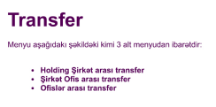

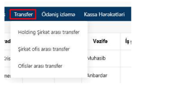

+-----------------------------+
|Holdinq Şirkət arası Transfer|
+-----------------------------+

Holdinq Şirkət arası Transfer
-----------------------------

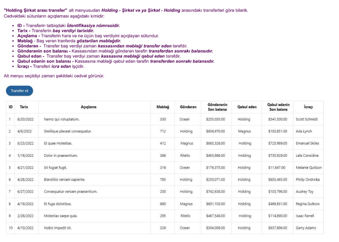

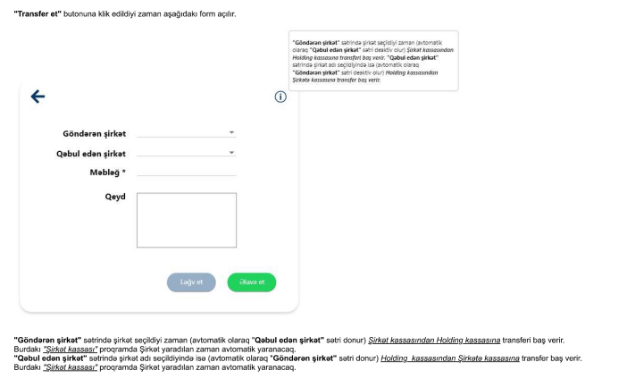

- Holdinq-şirkət arası transfer etmək
    - endpoint: "http://localhost:8000/api/v1/transfer/holding-transfer/"
    - Json-da göndərilməli olan datalar:
        - "sending_company_id" -> nullable, Göndərən şirkət - Company id
            - Göndərən fieldinə şirkət id-si qeyd edilərsə həmin şirkətdən holdingə transfer əməliyyatı edilir.
            - Şirkətlərin id-ləri üçün endpoint: "http://localhost:8000/api/v1/company/?is_active=true"
        - "receiving_company_id" -> nullable, Qəbul edən şirkət - Company id
            - Qəbul edən fieldinə şirkət id-si qeyd edilərsə holdingdən həmin şirkətə transfer əməliyyatı edilir.
            - Şirkətlərin id-ləri üçün endpoint: "http://localhost:8000/api/v1/company/?is_active=true"
        - "transfer_amount" -> required, transfer məbləği - float
        - "transfer_note" -> nullable, transfer qeydi - str
    - sending_company_id və receiving_company_id-dən yalnız 1 göndərilməlidir, 2-si bir yerdə göndərilə bilməz.

.. code:: json

  {
    "sending_company_id": 4,
    "receiving_company_id": null,
    "transfer_amount": 100,
    "transfer_note": "test company to holding transfer"
  }

- Bütün holding-şirkət arası transferlərə bax
    - endpoint: "http://localhost:8000/api/v1/transfer/holding-transfer/"
    - Json-da gələn data:
        - "executor" -> icra edən işçi - User
        - "sending_company" -> Göndərən şirkət - Company
        - "receiving_company" -> Qəbul edən şirkət - Company
        - "transfer_amount" -> transfer məbləği - float
        - "transfer_date" -> Transfer tarixi - Date
        - "transfer_note" -> Transfer qeydi - String
        - "recipient_subsequent_balance" -> Qəbul edən son balansı - float
        - "sender_subsequent_balance" -> Göndərən son balansı - float

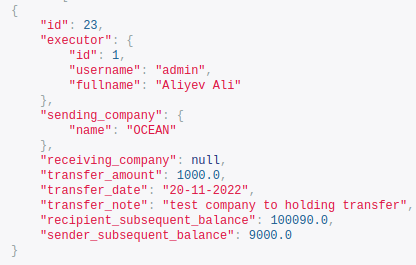

- Filter:
    - "http://localhost:8000/api/v1/transfer/holding-transfer/?executor__fullname=&executor__fullname__icontains=&executor__position__name=&executor__position__name__icontains=&executor__employee_status__status_name=&executor__employee_status__status_name__icontains=&sending_company__name=&sending_company__name__icontains=&receiving_company__name=&receiving_company__name__icontains=&recipient_subsequent_balance=&sender_subsequent_balance=&transfer_amount=&transfer_amount__gte=&transfer_amount__lte=&transfer_note=&transfer_note__icontains=&transfer_date=&transfer_date__gte=&transfer_date__lte="

+--------------------------+
|Şirkət Ofis arası Transfer|
+--------------------------+

Şirkət Ofis arası Transfer
--------------------------

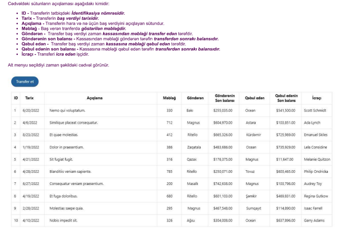

- Şirkət Ofis arası Transfer etmək
    - endpoint: "http://localhost:8000/api/v1/transfer/company-transfer/"
    - Json-da göndərilməli olan datalar:
        - "company_id" -> required, Göndərən şirkət - Company id
            - Şirkətlərin id-ləri üçün endpoint: "http://localhost:8000/api/v1/company/?is_active=true"
        - "sending_office_id" -> nullable, Göndərən Ofis - Office id
            - Göndərən fieldinə Ofis id-si qeyd edilərsə həmin Ofisdən şikətə transfer əməliyyatı edilir.
            - Ofislərin id-ləri üçün endpoint: "http://localhost:8000/api/v1/company/offices/?company=&company__id=&company__name=&company__name__icontains=&is_active=true"
        - "receiving_office_id" -> nullable, Qəbul edən Ofis - Office id
            - Qəbul edən fieldinə Ofis id-si qeyd edilərsə şikətdən həmin Ofisə transfer əməliyyatı edilir.
            - Ofislərin id-ləri üçün endpoint: "http://localhost:8000/api/v1/company/offices/?company=&company__id=&company__name=&company__name__icontains=&is_active=true"
        - "transfer_amount" -> required,transfer məbləği - float
        - "transfer_note" -> nullable, transfer qeydi - str
    - sending_office_id və receiving_office_id-dən yalnız 1 göndərilməlidir, 2-si bir yerdə göndərilə bilməz.

.. code:: json

  {
    "company_id": 4,
    "sending_office_id": 2,
    "receiving_office_id": null,
    "transfer_amount": 100,
    "transfer_note": "test"
  }

- Bütün Şirkət Ofis arası Transferlərə bax
    - endpoint: "http://localhost:8000/api/v1/transfer/company-transfer/"
    - Json-da gələn data:
        - "executor" -> icra edən işçi - User
        - "company" -> Şirkət - Company
        - "sending_office" -> Göndərən ofis - Office
        - "receiving_office" -> Qəbul ofis - Office
        - "transfer_amount" -> transfer məbləği - float
        - "transfer_date" -> Transfer tarixi - Date
        - "transfer_note" -> Transfer qeydi - String
        - "recipient_subsequent_balance" -> Qəbul edən son balansı - float
        - "sender_subsequent_balance" -> Göndərən son balansı - float

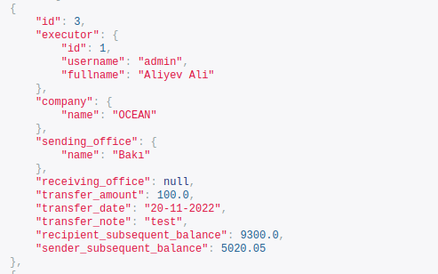

- Filter:
    - "http://localhost:8000/api/v1/transfer/company-transfer/?executor__fullname=&executor__fullname__icontains=&executor__position__name=&executor__position__name__icontains=&executor__employee_status__status_name=&executor__employee_status__status_name__icontains=&company=&company__name=&company__name__icontains=&sending_office__name=&sending_office__name__icontains=&receiving_office__name=&receiving_office__name__icontains=&recipient_subsequent_balance=&sender_subsequent_balance=&transfer_amount=&transfer_amount__gte=&transfer_amount__lte=&transfer_note=&transfer_note__icontains=&transfer_date=&transfer_date__gte=&transfer_date__lte="

+----------------------+
|Ofislər arası Transfer|
+----------------------+

Ofislər arası Transfer
----------------------

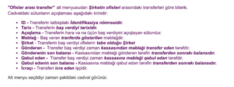

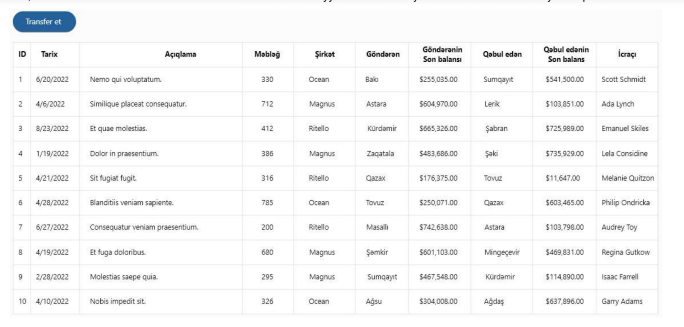

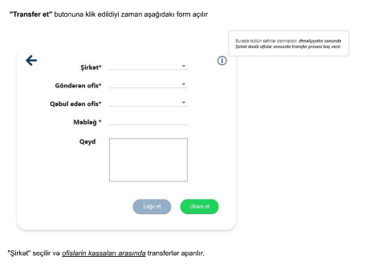

- Ofislər arası Transfer etmək
    - endpoint: "http://localhost:8000/api/v1/transfer/office-transfer/"
    - Json-da göndərilməli olan datalar:
        - "company_id" -> required, Göndərən şirkət - Company id
            - Şirkətlərin id-ləri üçün endpoint: "http://localhost:8000/api/v1/company/?is_active=true"
        - "sending_office_id" -> required, Göndərən Ofis - Office id
            - Ofislərin id-ləri üçün endpoint: "http://localhost:8000/api/v1/company/offices/?company=&company__id=&company__name=&company__name__icontains=&is_active=true"
        - "receiving_office_id" -> required, Qəbul edən Ofis - Office id
            - Ofislərin id-ləri üçün endpoint: "http://localhost:8000/api/v1/company/offices/?company=&company__id=&company__name=&company__name__icontains=&is_active=true"
        - "transfer_amount" -> required,transfer məbləği - float
        - "transfer_note" -> nullable, transfer qeydi - str

.. code:: json

  {
    "company_id": 4,
    "sending_office_id": 2,
    "receiving_office_id": 3,
    "transfer_amount": 100,
    "transfer_note": "test"
  }

- Bütün Ofislər arası Transferlərə bax
    - endpoint: "http://localhost:8000/api/v1/transfer/office-transfer/"
    - Json-da gələn data:
        - "executor" -> icra edən işçi - User
        - "company" -> Şirkət - Company
        - "sending_office" -> Göndərən ofis - Office
        - "receiving_office" -> Qəbul ofis - Office
        - "transfer_amount" -> transfer məbləği - float
        - "transfer_date" -> Transfer tarixi - Date
        - "transfer_note" -> Transfer qeydi - String
        - "recipient_subsequent_balance" -> Qəbul edən son balansı - float
        - "sender_subsequent_balance" -> Göndərən son balansı - float

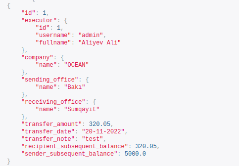

- Filter:
    - "http://localhost:8000/api/v1/transfer/office-transfer/?executor__fullname=&executor__fullname__icontains=&executor__position__name=&executor__position__name__icontains=&executor__employee_status__status_name=&executor__employee_status__status_name__icontains=&company=&company__name=&company__name__icontains=&sending_office__name=&sending_office__name__icontains=&receiving_office__name=&receiving_office__name__icontains=&recipient_subsequent_balance=&sender_subsequent_balance=&transfer_amount=&transfer_amount__gte=&transfer_amount__lte=&transfer_note=&transfer_note__icontains=&transfer_date=&transfer_date__gte=&transfer_date__lte="
