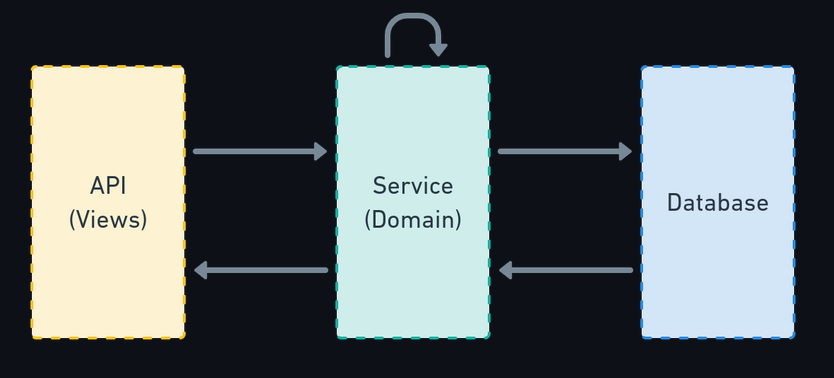

#################
Project Structure
#################

+-----------+
|Kodaze ERP |
+-----------+

.. image:: _static/my_project_visualized.png
   :width: 2500px
   :height: 1000px
   :scale: 50 %
   :alt: alternate text
   :align: center

Proyekt aşağıdakı app-lərdən ibarətdir:

1. account (işçilər, müştərilər üçün)
2. backup_restore (database məlumatlarını backup etmək üçün)
3. cashbox (kassa üçün)
4. company (holdinq, şirkət, ofis, department, vəzifə üçün) - Tam hazır deyil
5. contract (müqavilələr üçün) - Tam hazır deyil
6. holiday (tətil günləri üçün) - Tam hazır deyil
7. income_expense (mədaxil məxaric məsələləri üçün)
8. product (məhsullar üçün)
9. salary (maaş, avans, kəsinti, cərimə, komissiyalar kimi məlumatlar üçün)
10. services (servislər üçün) - Tam hazır deyil
11. task_manager (tapşırıqlar, elanlar üçün)
12. transfer (transfer əməliyyatı üçün) - Tam hazır deyil
13. update (proyektin update olunması üçün)
14. warehouse (anbar və stok məlumatları üçün)

+----------------+
|API sturukturu: |
+----------------+

1. filters.py
2. permissions.py
3. serializers.py
4. services.py
5. urls.py
6. utils.py
7. views.py

Yeni bir app əlavə olunacaqsa bu sturuktura əməl olunmalıdır. Bütün create, update kimi funksiyalar services.py
file-da yazılmalıdır, views.py file-da isə bu funksiyalar çağırılır. update-ləri services.py da yazmağa hər zaman
ehtiyac yoxdur. Əgər əlavə bir iş görülməyəcəksə django rest framework-un update metodu istifadə oluna bilər.

